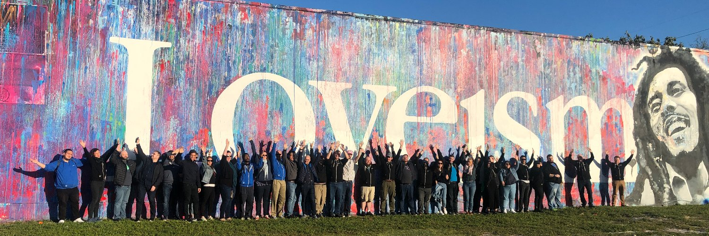

<!--
_style: |
  figure {
    background-color: blue;
  }
-->

# Defining the Roles within Developer Relations

---

# About Phil [@leggetter](https://twitter.com/leggetter)

* Software Engineer ➡ DevRel (2010)
* Developer Evangelist @ [Pusher](https://pusher.com)
* Developer Evangelist @ [BladeRunnerJS](http://bladerunnerjs.org)
* Head of DevRel @ Pusher
* Snr. Director  Platform & Developer Experience @ [Nexmo/Vonage](https://developer.vonage.com)
* Developer Experience & Relations @ **[tru.ID](https://tru.id)**

---

<!--
footer:  Phil [@leggetter](https://twitter.com/leggetter)
-->

# Why Role Definitions Matter

* Clarity for the individual in the role
* Guidance for those interacting with someone in a role
* Identify an entry point into DevRel
* Roles within a team represent the implementation of a strategy

---

# 📝 A Note on Strategy
* ## Don't Start with the Roles
  ## Start with the Strategy

* > We're looking for a "Developer Relations... Person"
    > _-- Any company that doesn't yet have a strategy_

* 

---

# Role "Popularity" (1)

| **Role**                                  | **Hits on Google**    |
| :-----------------------------------------| :-------------------- |
| Community Manager                         | 26,000,000            |
| Developer Advocate                        | 736,000               |
| Developer Educator                        | 241,000               |
| Developer Evangelist                      | 168,000               |
| Developer Relations Engineer              | 26,000                |
| Developer Experience Engineer             | 18,900                |

---

# Role "Popularity" (2)

| **Role**                                                          | **Mentions †**   |
| :---------------------------------------------------------------- | :------------------- |
| Community Manager                         | 19                    |
| Developer Advocate                        | 159                   |
| Developer Educator                        | 3                     |
| Developer Evangelist                      | 31                    |
| Developer Relations Engineer              | 21                    |
| Developer Experience Engineer             | 3                     |

_† Source: One Year of Jobs from [DevRel Weekly Jobs on raindrop.io](https://raindrop.io/collection/10525990)_

---
<!-- _class: invert -->

# Any Obvious Role Omissions?

---
<!-- _class: invert -->

# Share Your Role